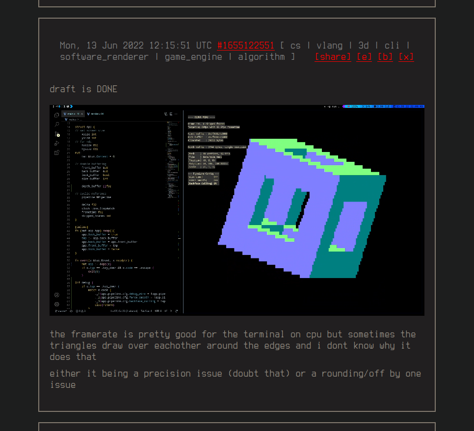
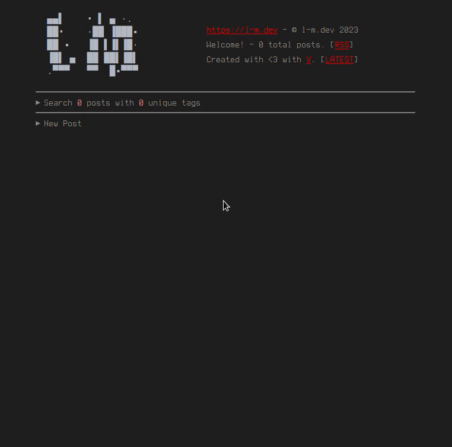
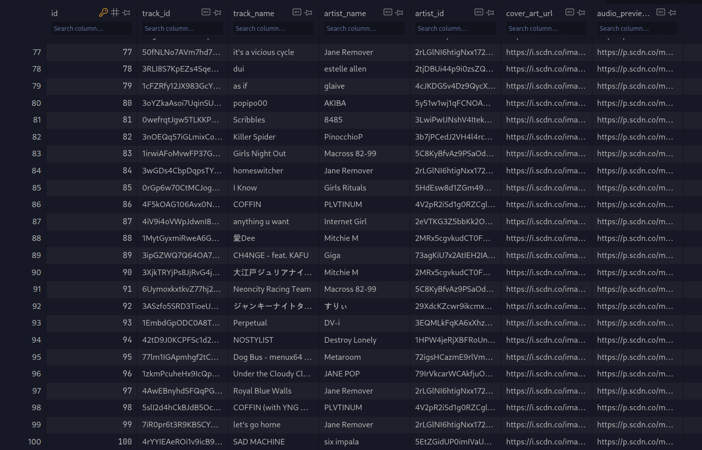
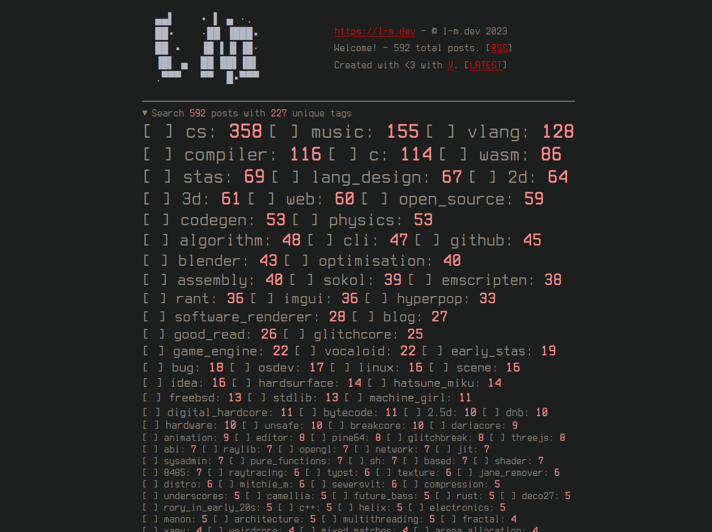

# [me.l-m.dev](https://me.l-m.dev)

This is [me.l-m.dev](https://me.l-m.dev), a complete upgrade from an older linear blogging system.

It has been built from the ground up in V using a high performance custom made barebones HTTP web server/framework. This is a self contained site, with zero JavaScript.

How did I do it?

A large amount of templating, messing around with `sqlite3`, a single threaded `picoev` event loop, HTTP spec caching/etags, lots of regex, and a lot of thinking.

1. [Three Undocumented Projects And The Three Month Hiatus](https://l-m.dev/cs/three_undocumented_projects/)

	Introduction to me.l-m.dev.
	
1. [Shipping 700KiBs of compressed HTML isn't viable?](https://l-m.dev/cs/pagination_for_linear_blog/)

	Implementing pagination and a navbar for me.l-m.dev.

# posts

I worked hard to make a nice interface, one which is fast and dynamic, and uses zero JavaScript. I relied a lot on the existing HTTP standard + URLs, to jump you to specific parts of the page and use HTML forms to change content. 

Jump links using `/?p=00000000##` are used extensively by the backend to route the client.

Proper configurable pagination is supported.

# safe youtube + spotify embed

YouTube and Spotify embeds are by design, horrible offenders in the amount of JavaScript they ship to clients to perform tracking.

The backend only needs to scrape Spotify servers once, using regex to get the metadata it needs. All media YouTube thumbnails and Spotify media are saved to the primary database for further reads after that.

# tags and searching

A space separated list of tags can be applied to a post. Inside the search tab at the very top, you can search for these tags and the content within.

The search functionality uses a case insensitive glob query.

- `*.wasm`
	- `test/helo.wasm`
	- `file.wasm`
- `stas*compiler`
	- `stas COMPILER`
	- `stas#0000000comPiler`
	- `stas is my programming language i implemented in my first compiler`

# go see for yourself!

- I created this website for myself in V.
- I have open sourced it under AGPLV3.
- Go visit [me.l-m.dev](https://me.l-m.dev).

# how to build

Building with V is easy, simply have the V compiler installed on your system and run `v .` in the root directory of the repository.

You can get a copy of the v compiler [here](https://vlang.io/).

# running the webserver

The server expects a few things in order to run:
- There must be a `backup/` folder in the working directory of the executable.
- The `SECRET` envvar should be set, and is used in `https://<url>/auth`.
- The `base_url` const in `main.v` should be changed to point to your website's URL.
- Optionally, the `PORT` envvar can be set, but defaults to port 8080.
